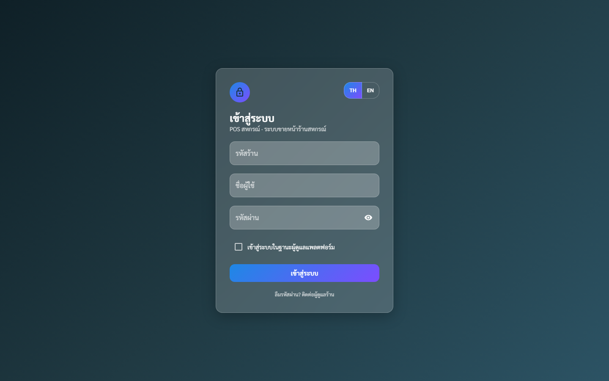
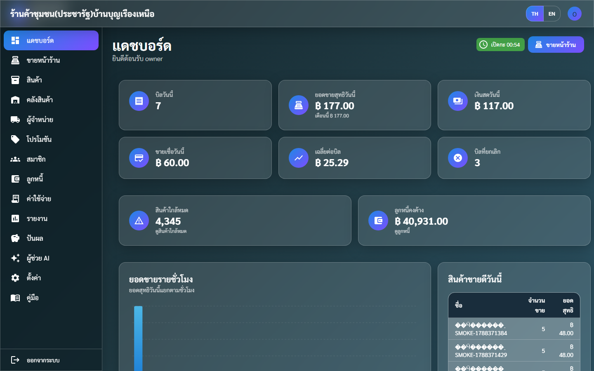
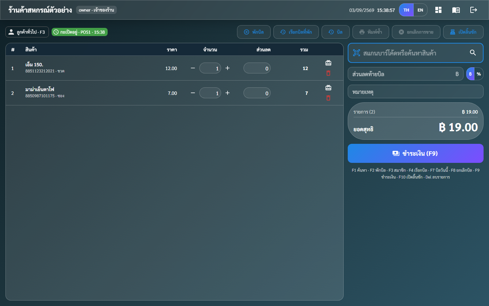
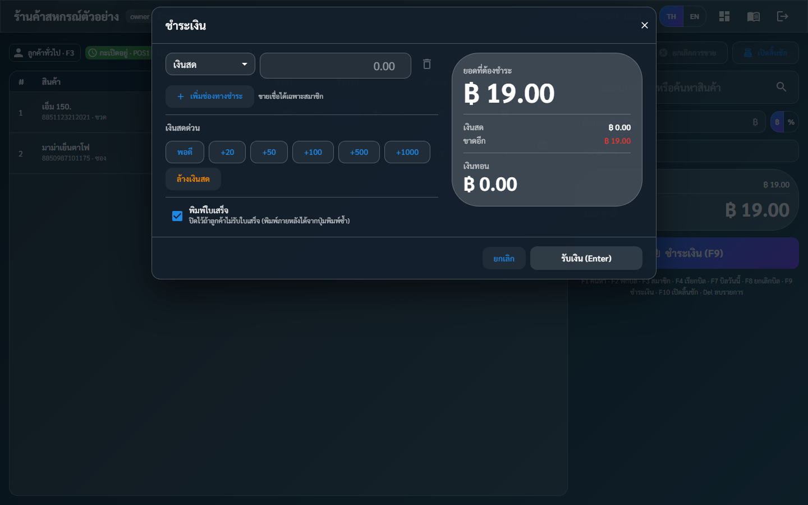
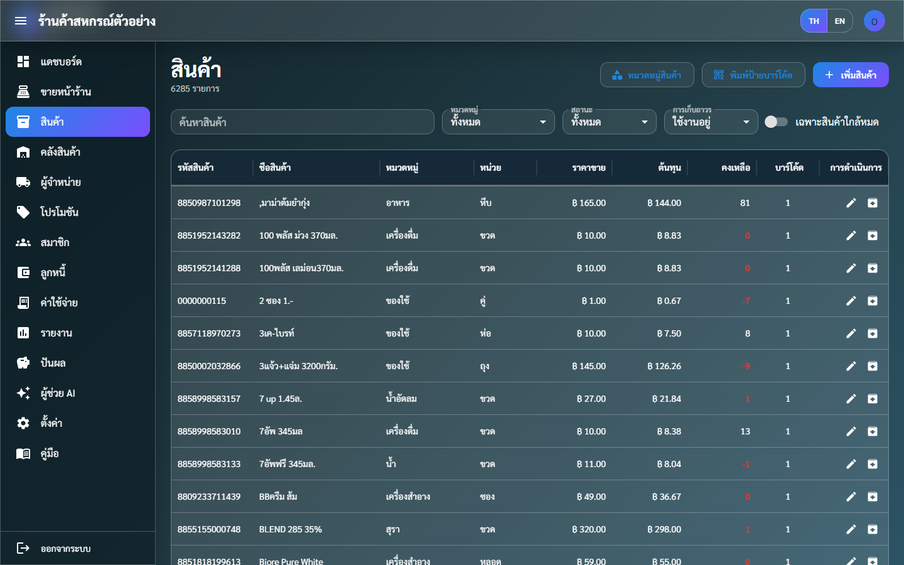
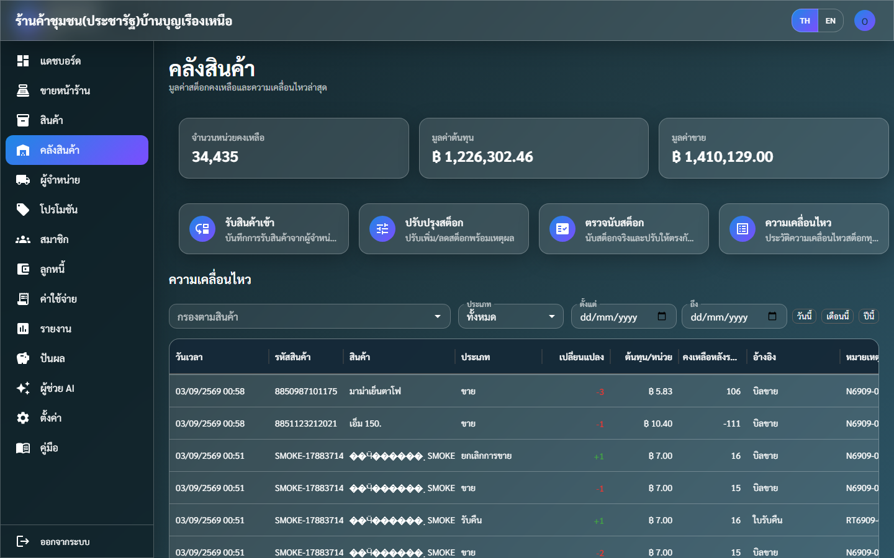
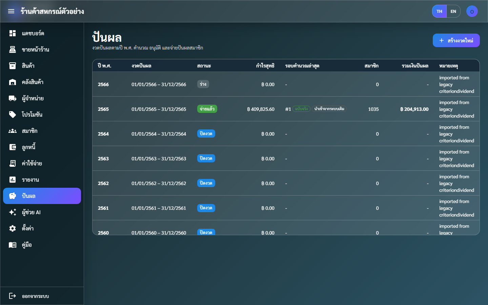
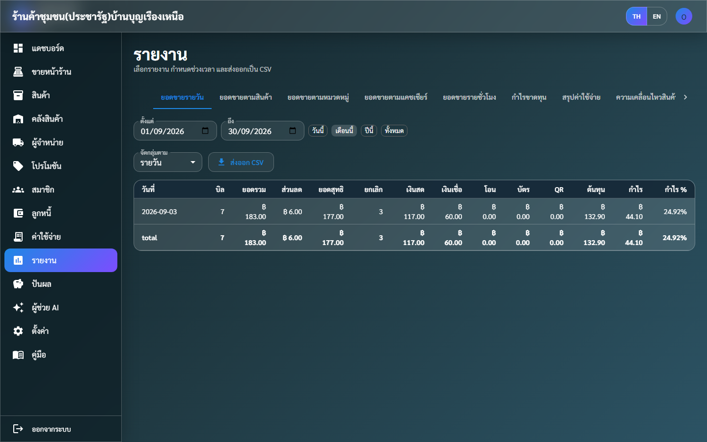
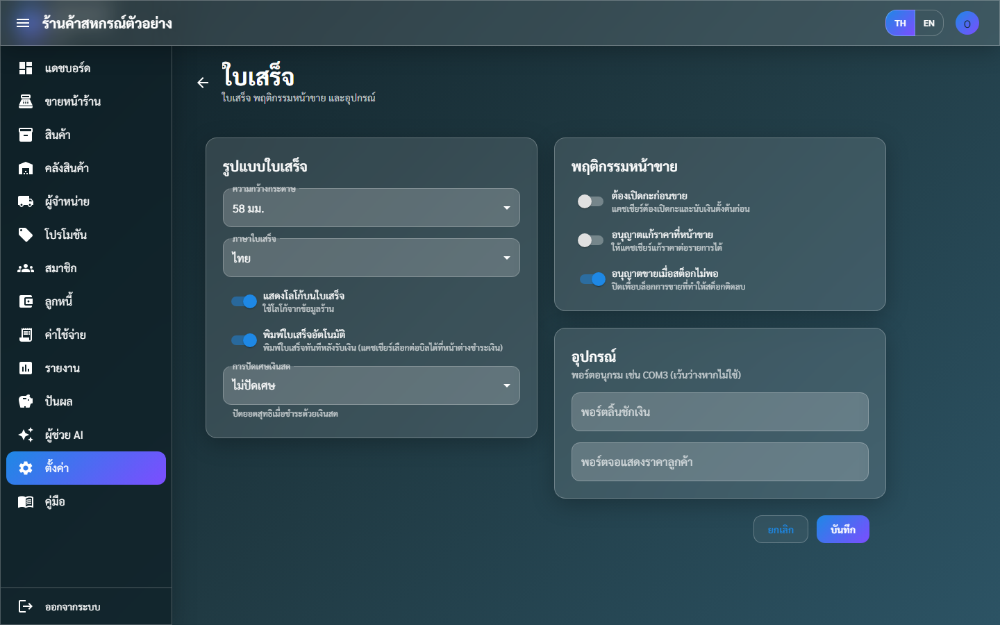
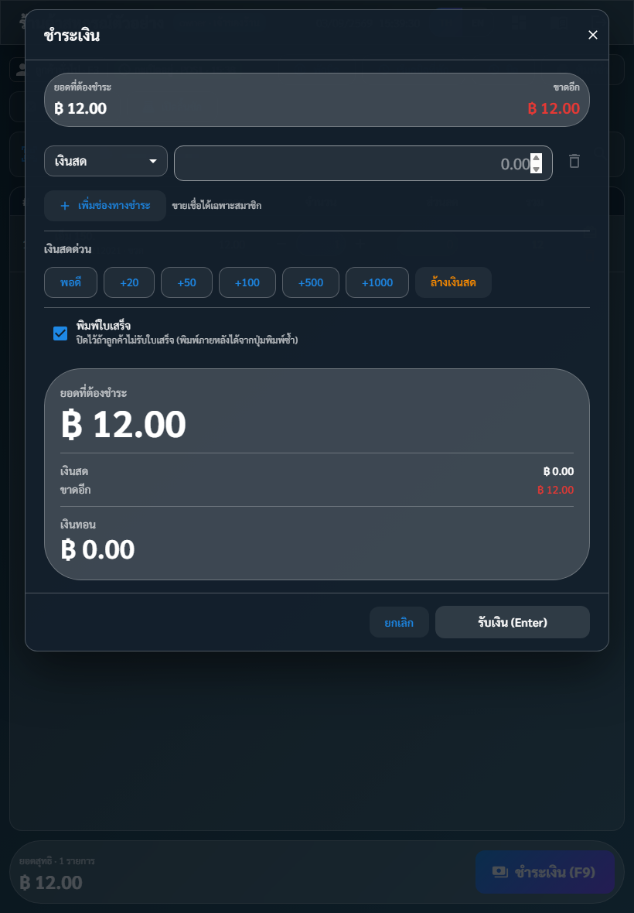

# คู่มือผู้ใช้งาน POS สหกรณ์ (User Guide)

คู่มือนี้อธิบายการใช้งานทุกหน้าจอของระบบ **POS สหกรณ์** สำหรับพนักงานร้าน (แคชเชียร์ ผู้จัดการ เจ้าของร้าน) ผู้ดูแลระบบกลาง และสมาชิกที่ใช้ผ่าน LINE
ชื่อเมนู/ปุ่มในคู่มือตรงกับที่แสดงบนหน้าจอภาษาไทย (สลับเป็นภาษาอังกฤษได้ทุกหน้าด้วยปุ่ม **TH / EN** มุมขวาบน)

เอกสารที่เกี่ยวข้อง: [คู่มือติดตั้งและดูแลระบบ](DEPLOY.md) · [การย้ายข้อมูลจากระบบเดิม](MIGRATION.md) · [สูตรปันผล](DIVIDEND_MATH.md)

---

## สารบัญ

1. [ภาพรวมระบบและบทบาทผู้ใช้](#1-ภาพรวมระบบและบทบาทผู้ใช้)
2. [การเข้าสู่ระบบและบัญชีของฉัน](#2-การเข้าสู่ระบบและบัญชีของฉัน)
3. [แดชบอร์ด](#3-แดชบอร์ด)
4. [ขายหน้าร้าน (POS)](#4-ขายหน้าร้าน-pos)
5. [การจัดการกะและลิ้นชักเงิน](#5-การจัดการกะและลิ้นชักเงิน)
6. [สินค้า](#6-สินค้า)
7. [คลังสินค้า](#7-คลังสินค้า)
8. [ผู้จำหน่าย](#8-ผู้จำหน่าย)
9. [สมาชิกและทุนเรือนหุ้น](#9-สมาชิกและทุนเรือนหุ้น)
10. [ลูกหนี้ (ขายเชื่อ)](#10-ลูกหนี้-ขายเชื่อ)
11. [ค่าใช้จ่าย](#11-ค่าใช้จ่าย)
12. [โปรโมชัน](#12-โปรโมชัน)
13. [ปันผลรายปี](#13-ปันผลรายปี)
14. [รายงาน](#14-รายงาน)
15. [ตั้งค่า](#15-ตั้งค่า)
16. [ผู้ดูแลแพลตฟอร์ม (หลายร้าน)](#16-ผู้ดูแลแพลตฟอร์ม-หลายร้าน)
17. [สมาชิกผ่าน LINE (LIFF)](#17-สมาชิกผ่าน-line-liff)
18. [ผู้ช่วย AI](#18-ผู้ช่วย-ai)
19. [ข้อความแจ้งเตือนและวิธีแก้](#19-ข้อความแจ้งเตือนและวิธีแก้)
20. [ภาคผนวก](#20-ภาคผนวก)

---

## 1. ภาพรวมระบบและบทบาทผู้ใช้

ระบบเป็นเว็บแอป ใช้ได้จากเบราว์เซอร์ (Chrome/Edge แนะนำ) บนคอมพิวเตอร์ แท็บเล็ต หรือมือถือ 1 ระบบรองรับได้หลายร้าน ข้อมูลของแต่ละร้านแยกกันโดยสิ้นเชิง ผู้ใช้เลือกร้านตอนเข้าสู่ระบบด้วย **รหัสร้าน**

### 1.1 บทบาท (role) และสิทธิ์

| การทำงาน | เจ้าของร้าน (store_owner) | ผู้จัดการ (manager) | แคชเชียร์ (cashier) | ผู้ดูข้อมูล (viewer) |
|---|:-:|:-:|:-:|:-:|
| ขายหน้าร้าน, พักบิล, เปิด/ปิดกะ, เปิดลิ้นชัก | ✅ | ✅ | ✅ | – |
| รับชำระลูกหนี้, บันทึกค่าใช้จ่าย, ค้นหาสมาชิก, สร้างรหัสเชื่อม LINE | ✅ | ✅ | ✅ | – |
| ยกเลิกบิล, คืนสินค้า | ✅ | ✅ | – | – |
| เพิ่ม/แก้ไขสินค้า หมวดหมู่ หน่วย ผู้จำหน่าย โปรโมชัน | ✅ | ✅ | – | – |
| รับสินค้าเข้า, ปรับปรุงสต็อก, ตรวจนับสต็อก | ✅ | ✅ | – | – |
| เพิ่ม/แก้ไขสมาชิก, บันทึกรายการหุ้น | ✅ | ✅ | – | – |
| ปันผล: สร้างงวด แก้เกณฑ์ จำลองการคำนวณ | ✅ | ✅ | – | – |
| ปันผล: อนุมัติ บันทึกจ่าย ปิดงวด บันทึกการจ่ายรายคน | ✅ | – | – | – |
| ตั้งค่าใบเสร็จ/พฤติกรรมหน้าขาย, ดูบันทึกการใช้งาน (audit) | ✅ | ✅ | – | – |
| ข้อมูลร้าน, โลโก้, ผู้ใช้งานและบทบาท | ✅ | – | – | – |
| ดูรายงาน, ประวัติการขาย, ความเคลื่อนไหวสต็อก, อายุหนี้ | ✅ | ✅ | ✅ | ✅ |
| ผู้ช่วย AI | ✅ | ✅ | – | – |

**ผู้ดูแลแพลตฟอร์ม (platform_admin)** อยู่เหนือทุกร้าน: สร้างร้านใหม่ เข้าดู/แก้ไขข้อมูลร้านใดก็ได้ (ดูข้อ 16)
**สมาชิก (member)** เข้าผ่าน LINE เท่านั้น ดูข้อมูลของตนเอง (ดูข้อ 17)

### 1.2 ส่วนประกอบหน้าจอ

- **แถบด้านบน**: ชื่อร้าน, ปุ่มสลับภาษา **TH / EN**, เมนูผู้ใช้ (โปรไฟล์, เปลี่ยนรหัสผ่าน, ออกจากระบบ)
- **เมนูด้านซ้าย** (หลังร้าน): แดชบอร์ด · ขายหน้าร้าน · สินค้า · คลังสินค้า · ผู้จำหน่าย · โปรโมชัน · สมาชิก · ลูกหนี้ · ค่าใช้จ่าย · รายงาน · ปันผล · ผู้ช่วย AI · ตั้งค่า (บนมือถือกดไอคอน ☰ **เปิดเมนู**)
- **หน้าขาย** เป็นหน้าจอเต็มแยกต่างหาก (ไม่มีเมนูซ้าย) กลับหลังร้านด้วยไอคอนแดชบอร์ดมุมขวาบน

---

## 2. การเข้าสู่ระบบและบัญชีของฉัน

### 2.1 เข้าสู่ระบบ

1. เปิดเว็บ — จากอินเทอร์เน็ต `https://t-pos.tdev2022.com` หรือในร้าน `http://192.168.1.120:3010` (Tailscale `http://100.122.174.19:3010`) จะพบหน้า **เข้าสู่ระบบ**
2. กรอก **รหัสร้าน** (เช่น `BBR`), **ชื่อผู้ใช้**, **รหัสผ่าน** แล้วกด **เข้าสู่ระบบ**
3. ผู้ดูแลแพลตฟอร์มให้ติ๊ก **เข้าสู่ระบบในฐานะผู้ดูแลแพลตฟอร์ม** (ช่องรหัสร้านจะหายไป)
4. ระบบพาไป: แคชเชียร์ → หน้าขาย, บทบาทอื่น → แดชบอร์ด, ผู้ดูแลแพลตฟอร์ม → ร้านค้าทั้งหมด

> **หมายเหตุ** ถ้าขึ้น "รหัสร้าน ชื่อผู้ใช้ หรือรหัสผ่านไม่ถูกต้อง" ให้ตรวจตัวพิมพ์ใหญ่-เล็กของรหัสผ่าน รหัสร้านไม่สนใจตัวพิมพ์ · ลืมรหัสผ่านให้ติดต่อเจ้าของร้าน (ข้อ 15.3)

### 2.2 ถูกบังคับตั้งรหัสผ่านใหม่

ผู้ใช้ที่ย้ายมาจากระบบเดิม หรือที่เจ้าของร้านเพิ่งตั้งรหัสให้ จะเห็นข้อความ **กรุณาตั้งรหัสผ่านใหม่ก่อนใช้งาน** และถูกพาไปหน้า **เปลี่ยนรหัสผ่าน** ทันที กรอก **รหัสผ่านปัจจุบัน**, **รหัสผ่านใหม่** (อย่างน้อย 8 ตัวอักษร), **ยืนยันรหัสผ่านใหม่** แล้วกด **เปลี่ยนรหัสผ่าน**

### 2.3 สลับภาษา / ออกจากระบบ

- ปุ่ม **TH / EN** มีทุกหน้า รวมหน้าเข้าสู่ระบบ ระบบจำภาษาที่เลือกไว้ในเบราว์เซอร์และในบัญชีผู้ใช้
- **ออกจากระบบ** อยู่ในเมนูผู้ใช้ (มุมขวาบน) และท้ายเมนูด้านซ้าย; เซสชันหมดอายุอัตโนมัติเมื่อไม่ได้ใช้งานนาน (ข้อความ "เซสชันหมดอายุ กรุณาเข้าสู่ระบบอีกครั้ง")

---

## 3. แดชบอร์ด

แสดงภาพรวมของ **วันนี้** ทันทีที่เข้าระบบ:

| การ์ด | ความหมาย |
|---|---|
| **บิลวันนี้** | จำนวนบิลที่ขายสำเร็จวันนี้ |
| **ยอดขายสุทธิวันนี้** / **เดือนนี้** | ยอดขายหลังหักส่วนลด (ไม่รวมบิลที่ยกเลิก) วันนี้ และรวมตั้งแต่ต้นเดือน |
| **เงินสดวันนี้** / **ขายเชื่อวันนี้** | ยอดที่รับเป็นเงินสด และยอดที่ลงบัญชีลูกหนี้ |
| **เฉลี่ยต่อบิล**, **บิลที่ยกเลิก** | |
| **สินค้าใกล้หมด** | จำนวนสินค้าที่คงเหลือ ≤ จุดเตือน → ปุ่ม **ดูสินค้าใกล้หมด** |
| **ลูกหนี้คงค้าง** | ยอดค้างชำระรวมทุกสมาชิก → ปุ่ม **ดูลูกหนี้** |
| **ยอดขายรายชั่วโมง** | กราฟแท่งยอดสุทธิวันนี้แยกชั่วโมง |
| **สินค้าขายดีวันนี้** | 5 อันดับตามยอดสุทธิ |

ปุ่มมุมขวาบน: สถานะกะ (**ยังไม่เปิดกะ** / เปิดกะ เวลา…) และ **ขายหน้าร้าน** เพื่อไปหน้าขาย

---

## 4. ขายหน้าร้าน (POS)

### 4.1 หน้าจอ

*หน้าจอขายจริงหลังยิงบาร์โค้ด 2 รายการ*

ช่อง **สแกนบาร์โค้ดหรือค้นหาสินค้า** จะได้รับโฟกัสอัตโนมัติเสมอ — เครื่องยิงบาร์โค้ด (ที่ตั้งค่าให้ส่ง Enter ต่อท้าย) ใช้ได้ทันทีโดยไม่ต้องคลิก

### 4.2 เพิ่มสินค้าลงตะกร้า

| วิธี | ขั้นตอน |
|---|---|
| ยิงบาร์โค้ด | ยิงหรือพิมพ์บาร์โค้ด/รหัสสินค้าแล้วกด Enter → สินค้าเข้าตะกร้า 1 ชิ้น (ยิงซ้ำ = เพิ่มจำนวน) |
| ระบุจำนวนก่อนยิง | พิมพ์ `3*` แล้วยิงบาร์โค้ด (ระบบแสดง "จำนวน ×3") → เข้า 3 ชิ้น |
| บาร์โค้ดแพ็ก | ถ้าบาร์โค้ดนั้นตั้ง "จำนวนต่อแพ็ก" ไว้ (เช่น 12) ระบบจะเพิ่ม 12 ชิ้นของสินค้านั้น |
| ค้นหาด้วยชื่อ | พิมพ์ชื่อบางส่วนแล้ว Enter หรือกด **F1** → หน้าต่าง **ค้นหาสินค้า** เลือกรายการ |
| บาร์โค้ดไม่พบ | ขึ้น "ไม่พบบาร์โค้ด …" และเปิดหน้าต่างค้นหาให้อัตโนมัติ |
| **สแกนด้วยกล้อง** | กดไอคอนกล้องท้ายช่องสแกน หรือ **F6** → เปิดหน้าต่างกล้อง เล็งบาร์โค้ดในกรอบ ระบบเพิ่มสินค้าให้ทันทีพร้อมเสียง "ติ๊ด" และสแกนต่อได้เรื่อยๆ กด **เสร็จสิ้น** เมื่อครบ |

ในตะกร้าแต่ละบรรทัดแก้ไขได้: **จำนวน** (ปุ่ม − / + หรือพิมพ์), **ส่วนลด** ต่อรายการ (บาท), ไอคอน 🎁 **ของแถม (ไม่คิดเงิน)**, ไอคอนถังขยะ **นำออก** สินค้าที่ตั้ง "ติดตามซีเรียล" จะเปิดหน้าต่าง **ระบุหมายเลขเครื่อง (S/N)** เมื่อเพิ่ม

**อุปกรณ์สแกนที่ใช้ได้**

| อุปกรณ์ | การตั้งค่า |
|---|---|
| เครื่องยิงบาร์โค้ด USB / บลูทูธ | ใช้ได้ทันที ตั้งให้ยิงแล้วส่ง **Enter** ต่อท้าย (ค่าเริ่มต้นของเครื่องส่วนใหญ่) ระบบรับค่าที่ยิงได้แม้เคอร์เซอร์ไม่ได้อยู่ในช่องสแกน |
| เครื่อง PDA ที่มีหัวยิงในตัว (Zebra, Honeywell, Chainway ฯลฯ) | ตั้งโหมดส่งข้อมูลเป็น **คีย์บอร์ด (keyboard wedge / keystroke output)** และเพิ่ม **Enter** ต่อท้ายรหัส แล้วเปิดเว็บนี้ในเบราว์เซอร์ของเครื่อง — ไม่ต้องติดตั้งแอปเพิ่ม |
| กล้องของแท็บเล็ต/iPad/มือถือ | กดไอคอนกล้อง (หรือ F6) ตามตาราง 4.2 — ครั้งแรกเบราว์เซอร์จะถามสิทธิ์ใช้กล้อง ให้กด **อนุญาต** |

> **กล้องต้องเปิดผ่าน https** เท่านั้น (เช่น `https://t-pos.tdev2022.com`) ถ้าเปิดด้วยเลข IP ภายในแบบ `http://` เบราว์เซอร์จะไม่ยอมให้ใช้กล้อง และหน้าต่างจะแจ้งเตือนให้ทราบ · กล้องหลังชัดกว่ากล้องหน้า ถ้าเครื่องมีหลายกล้องกดปุ่มสลับกล้องมุมขวาล่างของภาพ · บางเครื่องมีไฟฉายให้เปิดช่วยเวลาแสงน้อย

> **ราคาที่ใช้**: ราคาขายปกติของสินค้า; ถ้าเลือกสมาชิกที่มี "ระดับราคา" และสินค้ามีราคาระดับนั้น ระบบใช้ราคาระดับสมาชิกให้อัตโนมัติ · ราคาต่อรายการแก้ไขได้เฉพาะเมื่อร้านเปิด "อนุญาตแก้ราคาที่หน้าขาย" (ข้อ 15.2) · ส่วนลดจากโปรโมชันคำนวณให้อัตโนมัติและแสดงบรรทัด **ส่วนลดโปรโมชัน**

### 4.3 ส่วนลดท้ายบิลและหมายเหตุ

ช่อง **ส่วนลดท้ายบิล** ใส่เป็นบาท (฿) หรือสลับเป็น % ระบบไม่ยอมให้ส่วนลดเกินยอดบิล ช่อง **หมายเหตุ** พิมพ์ลงบิลได้ ยอดในกล่อง **ยอดสุทธิ** คำนวณสดจากเซิร์ฟเวอร์ ("กำลังคำนวณราคา…")

### 4.4 เลือกสมาชิก (F3)

กด **F3** หรือปุ่มลูกค้าซ้ายบน → **ค้นหาสมาชิก (รหัส / ชื่อ / โทร)** → เลือก แถบจะแสดงรหัส ชื่อ หุ้น และ **ยอดค้างชำระ** (ถ้ามี) กด **ใช้ลูกค้าทั่วไป** เพื่อกลับเป็นขายทั่วไป
บิลที่ระบุสมาชิกจะนับเป็น **ยอดซื้อสะสม** ของสมาชิกนั้น (ใช้คำนวณเงินเฉลี่ยคืนตอนปันผล) — ควรถามสมาชิกทุกครั้ง

### 4.5 ชำระเงิน (F9)

กด **ชำระเงิน (F9)** เปิดหน้าต่าง **ชำระเงิน**:

1. **ยอดที่ต้องชำระ** แสดงมุมขวา
2. เลือก **วิธีชำระเงิน** ของช่องแรก: เงินสด / เงินโอน / บัตรเครดิต / QR พร้อมเพย์ / ขายเชื่อ / อื่นๆ แล้วกรอก **จำนวนเงิน** (เงินโอน/บัตรใส่ **เลขอ้างอิง** ได้)
3. **เงินสดด่วน**: ปุ่ม **พอดี**, **+20 +50 +100 +500 +1000** บวกเงินที่รับเข้าช่องเงินสด ปุ่ม **ล้างเงินสด** ล้างค่า
4. **แป้นตัวเลขในหน้าต่าง**: แตะช่องจำนวนเงินที่ต้องการแก้ (ช่องที่กำลังแก้จะมีกรอบสีฟ้า) แล้วกดตัวเลขบนแป้น — **⌫** ลบทีละตัว **C** ล้างทั้งช่อง ขณะเปิดแป้นนี้ระบบจะไม่เรียกคีย์บอร์ดของเครื่องขึ้นมา หน้าต่างจึงไม่ถูกบีบ (ดูข้อ 20.3) ปุ่ม **แสดงแป้นตัวเลข / ซ่อนแป้นตัวเลข** เปิด-ปิดได้ตลอดเวลา ระบบจำค่าที่เลือกไว้ในเครื่องนั้น ค่าเริ่มต้นตั้งได้ที่ **ตั้งค่า → ใบเสร็จ → แป้นตัวเลขในหน้าต่างชำระเงิน** (ข้อ 15.2)
5. **เพิ่มช่องทางชำระ** เพื่อแบ่งจ่ายหลายวิธีในบิลเดียว (เช่น โอน 100 + เงินสดที่เหลือ)
6. ระบบแสดง **เงินทอน** (สีเขียว) หรือ **ขาดอีก** (สีแดง) ตามเวลาจริง กด **รับเงิน (Enter)** เมื่อครบ

กฎการชำระ:
- เงินสดรับเกินได้ (ทอน); วิธีอื่นรับเกินยอดไม่ได้ ("ยอดชำระที่ไม่ใช่เงินสดเกินยอดที่ต้องชำระ")
- **ขายเชื่อ** ต้องเลือกสมาชิกก่อน (ไม่ใช่ลูกค้าทั่วไป) เลือกช่องทาง "ขายเชื่อ" โดยไม่ต้องใส่จำนวน = **ยอดที่เหลือจะบันทึกเป็นขายเชื่อ** (ใส่จำนวนได้ถ้าเชื่อบางส่วน) บิลจะไปอยู่ในหน้า **ลูกหนี้**
- ถ้าร้านเปิด "อนุญาตขายเมื่อสต็อกไม่พอ" = ปิด ระบบจะไม่ให้ขายสินค้าที่สต็อกไม่พอ ("สต็อกสินค้า … ไม่พอ")
- ถ้าร้านตั้ง "ต้องเปิดกะก่อนขาย" และยังไม่เปิดกะ ระบบจะแจ้ง "ยังไม่ได้เปิดกะ กรุณาเปิดกะก่อนขาย"

**เลือกพิมพ์/ไม่พิมพ์ใบเสร็จ**: ในหน้าต่างชำระเงินมีช่อง **พิมพ์ใบเสร็จ** (ติ๊กไว้ = พิมพ์)
- ค่าเริ่มต้นมาจาก **ตั้งค่า → ใบเสร็จ → พิมพ์ใบเสร็จอัตโนมัติ** ของร้าน (ข้อ 15.2)
- แคชเชียร์ติ๊ก/เอาออกได้ทุกบิล เช่น ลูกค้าไม่รับใบเสร็จก็เอาออก ระบบจะจำค่าที่เลือกไว้ในเครื่องนั้นเป็นค่าเริ่มต้นของบิลถัดไป
- ถ้าไม่ติ๊ก: ขายเสร็จแล้วกลับสู่หน้าขายทันที (ไม่เปิดหน้าต่างใบเสร็จ) — อยากได้ใบเสร็จภายหลังกด **พิมพ์ซ้ำ** ได้

เมื่อสำเร็จ: ขึ้น "บันทึกการขาย N6609-00012 แล้ว" ถ้าเลือกพิมพ์จะเปิดหน้าต่าง **ใบเสร็จ** และสั่งพิมพ์ให้อัตโนมัติ จากนั้นกด **ขายใหม่** (Enter) เพื่อเริ่มบิลถัดไป

### 4.6 ใบเสร็จและการพิมพ์

- ใบเสร็จแสดง ชื่อร้าน ที่อยู่ โทร เลขประจำตัวผู้เสียภาษี ข้อความหัวใบเสร็จ **เลขที่** วันที่ (ปี พ.ศ. เมื่อภาษาไทย) **แคชเชียร์** **สมาชิก**/ลูกค้าทั่วไป รายการ ส่วนลด **ยอดสุทธิ** วิธีชำระ **รับเงิน** **เงินทอน** ยอดค้างชำระ (บิลเชื่อ) และข้อความท้ายใบเสร็จ
- การพิมพ์ใช้หน้าต่างพิมพ์ของเบราว์เซอร์ ตั้งเครื่องพิมพ์ใบเสร็จ 58 หรือ 80 มม. เป็นค่าเริ่มต้นและปิดขอบกระดาษ ความกว้างเลือกที่ **ตั้งค่า → ใบเสร็จ → ความกว้างกระดาษ**
- **พิมพ์ซ้ำ** (บนแถบเครื่องมือ) = พิมพ์ใบเสร็จซ้ำ (บิลล่าสุด) มีคำว่า **สำเนา**; บิลเก่ากว่านั้นพิมพ์จาก **บิล (F7)** หรือ **ประวัติการขาย**

### 4.7 พักบิล / เรียกบิล

- **พักบิล (F2)**: ใส่ **ชื่อบิล** (เช่น ชื่อลูกค้า) → ตะกร้าถูกเก็บไว้ที่เซิร์ฟเวอร์ (ใช้ได้จากเครื่องอื่น) แล้วล้างตะกร้า
- **เรียกบิลที่พัก (F4)**: เลือกบิลจากรายการ (แสดงชื่อ จำนวนรายการ ยอด) → กลับเข้าตะกร้า เมื่อชำระเงินแล้วบิลที่พักจะถูกลบอัตโนมัติ ลบทิ้งได้ด้วยไอคอนถังขยะ บิลที่พักหมดอายุใน 1 วัน

### 4.8 ยกเลิกบิล (F8) และประวัติการขาย (F7)

- **บิล (F7)** เปิดรายการบิลวันนี้ (สถานะ สำเร็จ/ยกเลิก/คืนเงิน) กดดูรายละเอียด, **พิมพ์ซ้ำ**, หรือ **ยกเลิกบิล**
- **ยกเลิกการขาย (F8)** = ยกเลิกบิลล่าสุด ต้องเป็นผู้จัดการ/เจ้าของร้าน ใส่ **เหตุผลการยกเลิก** แล้วยืนยัน — สต็อกจะถูกคืนและยอดขายถูกตัดออกจากรายงาน (ย้อนกลับไม่ได้) ถ้าเป็นบิลเชื่อที่รับชำระไปแล้วบางส่วน ระบบจะไม่ให้ยกเลิก
- **ประวัติการขาย** (เมนู หน้าขาย → ประวัติ หรือปุ่ม **ดูประวัติทั้งหมด**) เลือก **จากวันที่/ถึงวันที่**, สถานะ, ค้นเลขบิล ดูรายละเอียด พิมพ์ซ้ำ ยกเลิก หรือ **คืนสินค้า** (ข้อ 4.9)

### 4.9 คืนสินค้า / คืนเงิน

ในรายละเอียดบิล (ประวัติการขาย) ผู้จัดการ/เจ้าของร้านกด **คืนสินค้า**: เลือกรายการและจำนวนที่คืน (ไม่เกินที่ขาย), วิธีคืนเงิน, ติ๊ก **รับสินค้ากลับเข้าสต็อก** หรือไม่, ใส่เหตุผล ระบบออกเอกสาร `RT…`, คืนเงินตามสัดส่วนราคาที่จ่ายจริง (หลังส่วนลด) ถ้าเป็นบิลเชื่อจะลดยอดค้างก่อน ส่วนที่เหลือจึงคืนเป็นเงินสด/อื่น สถานะบิลกลายเป็น **คืนบางส่วน** หรือ **คืนเงิน**

### 4.10 คีย์ลัดหน้าขาย

| คีย์ | การทำงาน |
|---|---|
| Enter (ในช่องสแกน) | ค้นหาบาร์โค้ด/สินค้า; `3*` ก่อนบาร์โค้ด = คูณจำนวน |
| F1 | ค้นหาสินค้า |
| F2 | พักบิล |
| F3 | เลือกสมาชิก |
| F4 | เรียกบิลที่พัก |
| F6 | สแกนด้วยกล้อง |
| F7 | บิลวันนี้ |
| F8 | ยกเลิกบิลล่าสุด (ผู้จัดการ/เจ้าของ) |
| F9 | ชำระเงิน (ในหน้าต่างชำระเงิน กด Enter = รับเงิน) |
| F10 | เปิดลิ้นชัก |
| Delete / Esc | นำรายการที่เลือกออก / ยกเลิกการเลือก |
| Enter (ในหน้าต่างใบเสร็จ) | ขายใหม่ |

---

## 5. การจัดการกะและลิ้นชักเงิน

หน้า **จัดการกะ** (หน้าขาย → ปุ่มสถานะกะ หรือเมนู กะ):

1. **เปิดกะ**: กรอก **เครื่อง** (เช่น POS1), **เงินสดตั้งต้น**, หมายเหตุ → **เปิดกะ** (หรือ **ไว้ทีหลัง** ถ้าร้านไม่บังคับ) พนักงาน 1 คนเปิดได้ครั้งละ 1 กะ
2. ระหว่างกะ ระบบสะสม **ขายเงินสด**, เงินเข้า/ออก จากการรับชำระลูกหนี้เงินสด, **นำเงินเข้า**/**นำเงินออก** (กรอกจำนวนและเหตุผล), ค่าใช้จ่ายที่ **หักจากลิ้นชักกะปัจจุบัน**, การยกเลิก/คืนเงินสด
3. **เปิดลิ้นชัก (F10)** = บันทึกการเปิดลิ้นชักโดยไม่ขาย (มีในบันทึกการใช้งาน)
4. **ปิดกะ**: ระบบแสดง **เงินสดที่ควรมี** (= เงินสดตั้งต้น + ขายเงินสด + นำเข้า − นำออก) กรอก **เงินสดที่นับได้** → **ผลต่าง** แสดง **ตรง / เกิน / ขาด** พร้อมสรุปยอดขายแยกวิธีชำระของกะนั้น
5. **กะที่ผ่านมา**: ดูรายละเอียดกะเก่า (เปิด/ปิดเมื่อ ผลต่าง) และรายงาน **รายงาน → ปิดยอดประจำวัน/กะ**

> ตั้งให้ "ต้องเปิดกะก่อนขาย" ได้ที่ ตั้งค่า → ใบเสร็จ → พฤติกรรมหน้าขาย

---

## 6. สินค้า

### 6.1 รายการสินค้า

เมนู **สินค้า** แสดงตาราง (รหัสสินค้า ชื่อสินค้า หมวดหมู่ หน่วย ราคาขาย ต้นทุน คงเหลือ บาร์โค้ด) ค้นหาด้วย **ค้นหาด้วยรหัส ชื่อ หรือบาร์โค้ด** กรอง **หมวดหมู่**, **สถานะ**, **การเก็บถาวร** (ใช้งานอยู่/เก็บถาวรแล้ว), ติ๊ก **เฉพาะสินค้าใกล้หมด** คงเหลือแสดงสีแดงเมื่อติดลบหรือต่ำกว่าจุดเตือน

ปุ่มด้านบน: **หมวดหมู่สินค้า**, **พิมพ์ป้ายบาร์โค้ด**, **เพิ่มสินค้า**

### 6.2 เพิ่ม/แก้ไขสินค้า

| ส่วน | ฟิลด์ |
|---|---|
| รายละเอียด | **รหัสสินค้า** (เว้นว่างระบบตั้งให้), **ชื่อสินค้า**, ชื่อ (อังกฤษ), **หมวดหมู่** (เพิ่มใหม่ในช่องได้), **หน่วย** (**เพิ่มหน่วย** ได้), **เปิดขาย**, **ติดตามซีเรียล** |
| ราคา | **ราคาขาย**, **ต้นทุนล่าสุด**, **ต้นทุนเฉลี่ย** (ระบบคำนวณจากการรับสินค้า แก้ไขเฉพาะเมื่อจำเป็น), **ราคาตามระดับสมาชิก** ระดับ 1–4 (เว้นว่างเพื่อใช้ราคาขายปกติ) |
| การตั้งค่าสต็อก | **จุดเตือน** (แจ้งเตือนเมื่อคงเหลือต่ำกว่านี้), **จุดวิกฤต**, **ยอดยกมา** (ตอนสร้างเท่านั้น — สร้างรายการ "ยอดยกมา" ในสมุดสต็อก) |
| บาร์โค้ด | **เพิ่มบาร์โค้ด** ได้หลายรหัสต่อสินค้า กำหนด **หลัก** และ **จำนวนต่อแพ็ก** (1 = ชิ้นเดียว) บาร์โค้ดซ้ำกับสินค้าอื่นไม่ได้ |
| ความเคลื่อนไหว | แท็บแสดงประวัติสต็อกของสินค้านี้ |

**เก็บถาวร** (แทนการลบ): สินค้าจะไม่แสดงในหน้าขายและตัวเลือกต่างๆ แต่ประวัติการขายยังอยู่ กด **กู้คืน** ได้ทุกเมื่อ สินค้าที่ย้ายมาจากระบบเดิมโดยไม่มีข้อมูลสินค้า จะมีชื่อขึ้นต้น `[ARCHIVED]`

### 6.3 หมวดหมู่และหน่วย

**หมวดหมู่สินค้า**: เพิ่ม/แก้ไข ชื่อ ชื่อ (อังกฤษ) ลำดับ เปิด/ปิดใช้งาน หน่วยนับ (ขวด ซอง ห่อ …) เพิ่มจากฟอร์มสินค้าด้วยปุ่ม **เพิ่มหน่วย**

### 6.4 พิมพ์ป้ายบาร์โค้ด

**สินค้า → พิมพ์ป้ายบาร์โค้ด**: **เลือกสินค้า** (หลายรายการ), เลือก **เทมเพลตป้าย** (เทมเพลตจากระบบเดิม A4/A5/A7/A9/A10 หรือ **เทมเพลตมาตรฐาน (A4 4×11)**), **จำนวนชุด** → **ตัวอย่างก่อนพิมพ์** → **พิมพ์** บาร์โค้ด 13 หลักพิมพ์เป็น EAN-13 อื่นๆ เป็น Code 128

---

## 7. คลังสินค้า

เมนู **คลังสินค้า** หน้าแรกแสดง **จำนวนหน่วยคงเหลือ**, **มูลค่าต้นทุน**, **มูลค่าขาย** และทางลัด 4 หมวด ทุกการเปลี่ยนแปลงสต็อกถูกบันทึกใน **ความเคลื่อนไหว** (ledger) แก้ตัวเลขคงเหลือตรงๆ ไม่ได้ ต้องผ่านเอกสารต่อไปนี้

### 7.1 รับสินค้าเข้า (`OD…`)

**คลังสินค้า → รับสินค้าเข้า → รับสินค้าใหม่**: เลือก **ผู้จำหน่าย** (เว้นว่างได้ / สร้างใหม่ในช่อง), **เลขที่อ้างอิงผู้จำหน่าย**, **วันที่รับ**, **ภาษีมูลค่าเพิ่ม** (ถ้ามี), หมายเหตุ แล้ว **เพิ่มสินค้า** ทีละรายการ (ค้นหาสินค้า → **จำนวน**, **ต้นทุน/หน่วย**) ระบบรวมยอดให้ → **บันทึกรับสินค้า**
ผล: สต็อกเพิ่ม, **ต้นทุนล่าสุด** = ต้นทุนที่รับ, **ต้นทุนเฉลี่ย** คำนวณใหม่แบบถัวเฉลี่ยถ่วงน้ำหนัก ยกเลิกใบรับได้จากรายละเอียด (**ยกเลิกใบรับ** — สต็อกจะถูกปรับกลับ)

### 7.2 ปรับปรุงสต็อก (`ADJ…`)

**ปรับปรุงสต็อก → ปรับปรุงสต็อกใหม่**: เลือก **เหตุผล** (ชำรุด / หมดอายุ / สูญหาย / พบเพิ่ม / แก้ไขยอด / ตัวอย่าง-ทดลอง / อื่นๆ), เพิ่มสินค้าและ **เปลี่ยนแปลง** (ค่าบวก = เพิ่ม, ค่าลบ = ลด) ระบบแสดง **ก่อนปรับ / หลังปรับ** → **บันทึกการปรับปรุง**

### 7.3 ตรวจนับสต็อก (`ST…`)

1. **ตรวจนับสต็อก → เริ่มตรวจนับใหม่**: เลือก **นับสินค้าทั้งหมด** หรือ **เลือกสินค้าที่จะนับ** → ระบบบันทึก **จำนวนในระบบ** ณ ขณะนั้น
2. ใบนับ: กรอก **จำนวนที่นับได้** ทีละรายการ (ค้นหา, กรอง **เฉพาะที่ยังไม่นับ** / **เฉพาะที่มีผลต่าง**) กด **บันทึกจำนวนที่นับ** ได้หลายครั้ง (บันทึกเฉพาะรายการที่แก้)
3. ดูสรุป **นับแล้ว / ยังไม่นับ / มีผลต่าง / มูลค่าผลต่าง** แล้วกด **ปิดการตรวจนับ** → ระบบสร้างรายการปรับสต็อกให้เท่าจำนวนที่นับได้ (รายการที่ยังไม่นับจะไม่ถูกปรับ) ใบที่ปิดแล้วแก้ไม่ได้

> ใช้การตรวจนับเพื่อแก้ **สต็อกติดลบ** ที่ตกทอดมาจากระบบเดิม (604 รายการ) — เลือกกรอง "สต็อกติดลบ" ในรายงานสถานะสต็อกเพื่อดูรายชื่อ

### 7.4 ความเคลื่อนไหว

ตารางทุกรายการ: **วันเวลา**, สินค้า, **ประเภท** (ยอดยกมา / ขาย / ยกเลิกการขาย / รับคืน / รับสินค้าเข้า / ยกเลิกรับสินค้า / ปรับปรุง / ตรวจนับ), **เปลี่ยนแปลง**, **ต้นทุน/หน่วย**, **คงเหลือหลังรายการ**, เอกสารอ้างอิง, ผู้ทำรายการ กรองตามสินค้าและช่วงวันที่ได้

---

## 8. ผู้จำหน่าย

เมนู **ผู้จำหน่าย**: **เพิ่มผู้จำหน่าย** / แก้ไข (รหัส ชื่อผู้จำหน่าย ที่อยู่ โทรศัพท์ แฟกซ์ อีเมล เลขประจำตัวผู้เสียภาษี หมายเหตุ) ค้นหาด้วยชื่อ ใช้เลือกในใบรับสินค้าและรายงาน **ซื้อตามผู้จำหน่าย**

---

## 9. สมาชิกและทุนเรือนหุ้น

### 9.1 ทะเบียนสมาชิก

เมนู **สมาชิก**: ค้นหา **รหัส ชื่อ หรือโทรศัพท์**, กรอง **สถานะ** (ใช้งาน/ไม่ใช้งาน/ระงับ) และ **หุ้น** (มีหุ้น/ไม่มีหุ้น) ตารางแสดง ทุนเรือนหุ้น **ยอดซื้อปีนี้** **ยอดค้างชำระ** และ **เชื่อม LINE แล้ว**
**เพิ่มสมาชิก**: **รหัสสมาชิก** (เว้นว่างเพื่อให้ระบบกำหนดให้), **ชื่อ-นามสกุล**, ที่อยู่ โทรศัพท์ อีเมล เลขบัตรประชาชน, **วันที่สมัคร**, **ระดับราคา** (ราคาปกติ / ระดับ 1–4), **หุ้นเริ่มต้น** (บาท), หมายเหตุ

สมาชิกรหัส `0` ชื่อ "ไม่ระบุ" คือ **ลูกค้าทั่วไป** (walk-in) ที่ระบบสร้างให้ ห้ามลบ

### 9.2 บัญชีหุ้น

ในหน้าสมาชิก แท็บ **บัญชีหุ้น** แสดง **ทุนเรือนหุ้นคงเหลือ** และรายการ (ยอดยกมา / ซื้อหุ้นเพิ่ม / ถอนหุ้น / ปรับปรุง / ปันผลเข้าหุ้น) กด **เพิ่มหุ้น** หรือ **ถอนหุ้น** → กรอก **จำนวนเงิน**, วันเวลา (เว้นว่าง = ตอนนี้), หมายเหตุ ถอนเกินยอดคงเหลือไม่ได้ ทุกรายการมี **คงเหลือหลังรายการ** และบันทึกผู้ทำรายการ

จำนวนหุ้นที่ใช้คำนวณปันผล = ทุนเรือนหุ้น ÷ บาทต่อหุ้นของงวด (เช่น ฿10,050 ÷ 50 = 201 หุ้น)

### 9.3 ยอดซื้อสะสม / ลูกหนี้ / ปันผล

- แท็บ **ยอดซื้อสะสม**: เลือก **ปี** → ยอดรายเดือน จำนวนบิล และ **บิลล่าสุด**
- แท็บ **ลูกหนี้**: บิลค้างและลิงก์ไปรับชำระ (ข้อ 10)
- แท็บ **ปันผล**: ประวัติปันผลทุกปีที่อนุมัติแล้ว (หุ้น ยอดซื้อ ปันผลตามหุ้น เฉลี่ยคืน รวม)

### 9.4 การเชื่อมต่อ LINE

แท็บ **การเชื่อมต่อ LINE**: กด **สร้างรหัสเชื่อมต่อ** → แสดง **รหัสเชื่อมต่อ** 6 ตัวและ **หมดอายุ** (15 นาที) ให้สมาชิกกรอกในแอป LINE (ข้อ 17) หรือสมาชิกใช้เบอร์โทรที่ตรงกับทะเบียน (ต้องไม่ซ้ำกับสมาชิกอื่น) **ยกเลิกการเชื่อม LINE** เมื่อสมาชิกเปลี่ยนบัญชี

### 9.5 เปลี่ยนสถานะ

เมนูสถานะในหน้าสมาชิก: **ใช้งาน / ไม่ใช้งาน / ระงับ** สมาชิกที่ไม่ใช้งานยังคงประวัติทั้งหมด

---

## 10. ลูกหนี้ (ขายเชื่อ)

### 10.1 บัญชีลูกหนี้

เมนู **ลูกหนี้** แสดงสมาชิกที่มียอดค้าง: **บิลค้าง**, **ยอดคงค้าง**, **ค้างนานสุด**, **ชำระล่าสุด** ค้นหาด้วยรหัส/ชื่อ กด **ดูข้อมูลสมาชิก** เพื่อดูบิลค้างชำระและ **ประวัติ** การรับชำระ

### 10.2 รับชำระเงิน

กด **รับชำระเงิน** (แคชเชียร์ทำได้):

1. เลือกสมาชิก (ถ้ายังไม่ได้เลือก)
2. เลือก **ตัดชำระบิลเก่าสุดก่อน** (ระบบไล่ตัดจากบิลเก่าที่สุด) หรือ **ชำระบิล** เฉพาะบิล
3. กรอก **ยอดชำระ** (ไม่เกินยอดค้าง — "ยอดเกินยอดค้างชำระ"), **วิธีชำระ** (เงินสด/โอน/บัตร/QR/อื่นๆ), หมายเหตุ → **รับชำระ**
4. ระบบออกเลขที่ `RC…`, อัปเดตสถานะบิลเป็น **ชำระบางส่วน** หรือ **ชำระแล้ว** และถ้าเป็นเงินสดจะบวกเข้ากะที่เปิดอยู่ (นำเงินเข้า)

### 10.3 อายุหนี้และใบแจ้งยอด

- **ลูกหนี้ → อายุหนี้**: ยอดค้างแยก **0–30 / 31–60 / 61–90 / มากกว่า 90 วัน** ณ วันที่ที่เลือก และ **อายุหนี้รายสมาชิก**
- **รายงาน → ใบแจ้งยอดลูกหนี้**: เลือกสมาชิกและช่วงเวลา → ยอดยกมา รายการเชื่อ (Dr) รับชำระ (Cr) ยอดคงเหลือปลายงวด ส่งออก CSV เพื่อพิมพ์ให้สมาชิก

> การชำระที่ย้ายมาจากระบบเดิมของบิลปี 2561–2562 (ที่ระบบเดิมลบไปแล้ว) จะแสดงในประวัติโดยไม่มีบิลให้เปิด

---

## 11. ค่าใช้จ่าย

เมนู **ค่าใช้จ่าย**: เลือกช่วงวันที่ (ค่าเริ่มต้น **เดือนนี้**) และ **หมวดค่าใช้จ่าย** ดู **รวมค่าใช้จ่าย**
**เพิ่มค่าใช้จ่าย**: **หมวดค่าใช้จ่าย** (จัดการหมวดได้ที่ **จัดการหมวดค่าใช้จ่าย** — ปิดใช้งานหมวดที่ไม่ใช้แล้วแทนการลบ), **วันที่**, **จำนวนเงิน**, **รายละเอียด**, **จ่ายจาก** (เงินสด/โอน/บัตร/QR/อื่นๆ), ติ๊ก **หักจากลิ้นชักกะปัจจุบัน** ถ้าหยิบเงินสดจากลิ้นชัก (ต้องมีกะที่เปิดอยู่ ยอดจะถูกหักตอนปิดกะ)
แคชเชียร์เพิ่มได้ แก้ไข/ลบต้องเป็นผู้จัดการขึ้นไป ค่าใช้จ่ายถูกนำไปหักในรายงาน **กำไรขาดทุน**

---

## 12. โปรโมชัน

เมนู **โปรโมชัน → เพิ่มโปรโมชัน**:

| ฟิลด์ | ความหมาย |
|---|---|
| **ชื่อโปรโมชัน** | แสดงในบิล/รายงาน |
| **ประเภท** | **รายสินค้า** (ต้องเลือก **สินค้า**) หรือ **ทั้งบิล** |
| **จำนวนขั้นต่ำ** (รายสินค้า) | ซื้อครบกี่ชิ้นจึงได้ส่วนลด; ส่วนลดแบบบาทให้ต่อทุกๆ N ชิ้น (ซื้อ 7 ชิ้น ขั้นต่ำ 3 → ได้ 2 ครั้ง) |
| **ยอดขั้นต่ำ** (ทั้งบิล) | ยอดบิลหลังส่วนลดรายการต้องถึงเท่านี้ |
| **รูปแบบส่วนลด / มูลค่าส่วนลด** | **จำนวนเงิน (บาท)** หรือ **เปอร์เซ็นต์** |
| **แถม** | จำนวนของแถม (สำหรับแสดง/บันทึก) |
| **เริ่ม / สิ้นสุด** | เว้นว่าง = ไม่จำกัดเวลา |
| **เปิดใช้งาน** | ปิดชั่วคราวได้โดยไม่ต้องลบ |

หน้าขายเลือกโปรโมชันที่ให้ส่วนลดสูงสุดต่อรายการ 1 รายการ และโปรโมชันทั้งบิลที่ให้ส่วนลดสูงสุด 1 รายการโดยอัตโนมัติ

---

## 13. ปันผลรายปี

### 13.1 แนวคิด

ปลายปี สหกรณ์นำ **กำไรสุทธิ** มาจัดสรรตาม **เกณฑ์การจัดสรร**:
- **ปันผลตามหุ้น** (กอง HUN): จำนวนเงิน = กำไรสุทธิ × ร้อยละ แบ่งให้สมาชิกตามจำนวนหุ้น (หุ้น = ทุนเรือนหุ้น ÷ **บาท/หุ้น**)
- **เฉลี่ยคืน** (กอง AVG): แบ่งตาม **ยอดซื้อ** ของสมาชิกในงวด (บิลที่ระบุสมาชิกและไม่ถูกยกเลิก)
- **อื่นๆ** (ทุนสำรอง ตอบแทนกรรมการ สาธารณประโยชน์ ฯลฯ): ตั้งเป็นร้อยละ ไม่แจกรายคน

รายละเอียดสูตรและตัวอย่างจริงปี 2565 อยู่ใน [DIVIDEND_MATH.md](DIVIDEND_MATH.md)

### 13.2 ขั้นตอน

1. **ปันผล → สร้างงวดใหม่**: **ปี พ.ศ.**, **วันเริ่มงวด/วันสิ้นงวด** (ค่าเริ่มต้น 1 ม.ค.–31 ธ.ค.), **กำไรสุทธิ** (นำจากรายงาน **กำไรขาดทุน** ทั้งปีหรือจากบัญชี), เลือก **คัดลอกเกณฑ์จากงวด** ก่อนหน้า หรือ **ใช้เกณฑ์มาตรฐาน** (50 บาท/หุ้น, ปันผลตามหุ้น 25 %, เฉลี่ยคืน 25 %, ทุนสำรอง 30 %, ตอบแทนกรรมการ 10 %, สาธารณประโยชน์ 10 %)
2. ในหน้างวด แก้ **เกณฑ์การจัดสรร**: ต้องมี **ปันผลตามหุ้น** 1 รายการพอดี (ระบุ **บาท/หุ้น**, **หุ้นสูงสุด/คน** และติ๊ก **จำกัดจำนวนหุ้นสูงสุด** ถ้าต้องการบังคับ) และรายการ **จัดสรร** ระบุ **ร้อยละ** และ **กองเงิน** (ปันผลตามหุ้น / เฉลี่ยคืน / อื่นๆ) **รวมการจัดสรร** ต้องไม่เกิน 100 % → **บันทึกเกณฑ์**
3. กด **จำลองการคำนวณ** → ได้ **รอบการคำนวณ** ใหม่ แสดง **หุ้นรวม**, **ยอดซื้อรวม**, **อัตราปันผล (บาท/หุ้น)**, อัตราเฉลี่ยคืน, **กองปันผล**, **กองเฉลี่ยคืน**, **รวมจ่ายทั้งหมด** และ **รายการรายสมาชิก** (ค้นหาได้) ตรวจสอบ แก้เกณฑ์/กำไรสุทธิ แล้วจำลองซ้ำได้ไม่จำกัดจนกว่าจะอนุมัติ
4. เจ้าของร้านกด **อนุมัติ** → รอบล่าสุดกลายเป็น **ฉบับจริง** เกณฑ์ถูกล็อก สถานะ **อนุมัติแล้ว**
5. จ่ายเงิน: ในรายการรายสมาชิกกด **บันทึกการจ่าย** ระบุ **จำนวนเงิน**, **วิธีจ่าย** (เงินสด / โอนเงิน / QR / บัตร / อื่นๆ / **นำเข้าหุ้น** = โอนปันผลเข้าทุนเรือนหุ้นทันที) ระบบแสดง **จ่ายแล้ว / คงเหลือ** ต่อคน เมื่อจ่ายครบทุกคน หรือกด **บันทึกว่าจ่ายแล้ว** สถานะเป็น **จ่ายแล้ว**
6. **ส่งออก CSV** รายการรายสมาชิก (ลำดับ รหัส ชื่อ ที่อยู่ ทุนเรือนหุ้น หุ้น ยอดซื้อ ปันผลตามหุ้น เฉลี่ยคืน รวม) สำหรับพิมพ์ใบแจ้ง/จ่ายเงิน
7. **ปิดงวด** เมื่อเสร็จสิ้น (บันทึกการจ่ายเพิ่มไม่ได้)

สถานะงวด: **ร่าง → จำลองแล้ว → อนุมัติแล้ว → จ่ายแล้ว → ปิดงวด** ย้อนสถานะไม่ได้

> งวด **2565** ที่ย้ายมาจากระบบเดิมมีรอบคำนวณ **นำเข้าจากระบบเดิม** เป็นฉบับจริง (1,035 ราย) ส่วนงวด **2566** มีเกณฑ์แล้วแต่ยังไม่คำนวณ ให้ใส่กำไรสุทธิและกด **จำลองการคำนวณ**
> แถว **ลูกค้าทั่วไป** ในรายการรายสมาชิกแสดงเฉลี่ยคืนของยอดขายที่ไม่ระบุสมาชิก (เหมือนระบบเดิม) ไม่สามารถบันทึกจ่ายได้

---

## 14. รายงาน

เมนู **รายงาน** เลือกแท็บ กำหนด **ตั้งแต่ / ถึง** (ทางลัด **วันนี้ / สัปดาห์นี้ / เดือนนี้ / ปีนี้**) กด **แสดงรายงาน** และ **ส่งออก CSV** (เปิดใน Excel ได้ ภาษาไทยถูกต้อง)

| รายงาน | เนื้อหา |
|---|---|
| **ยอดขายรายวัน** | บิล ยอดรวม ส่วนลด ยอดสุทธิ ยกเลิก แยกวิธีชำระ ต้นทุน กำไร กำไร % (จัดกลุ่ม **รายวัน/รายเดือน**) |
| **ยอดขายตามสินค้า** | จำนวน ยอดขาย ต้นทุน กำไร ต่อสินค้า (กรองหมวด เรียงตาม ยอดขาย/จำนวน/กำไร) |
| **ยอดขายตามหมวดหมู่**, **ยอดขายตามแคชเชียร์** (บิล ยอด ยกเลิก เฉลี่ย/บิล), **ยอดขายรายชั่วโมง** | |
| **ความเคลื่อนไหวสินค้า** | เลือกสินค้า → ยอดยกมา รับเข้า จ่ายออก คงเหลือ ทุกเอกสาร |
| **สถานะสต็อก** | คงเหลือ จุดเตือน ต้นทุน มูลค่าสต็อก ขาย/รับล่าสุด กรอง **ต่ำกว่าจุดเตือน / สต็อกเป็นศูนย์ / สต็อกติดลบ** |
| **สินค้าไม่เคลื่อนไหว** | สินค้าที่มีสต็อกแต่ **ไม่ขายมาแล้ว (วัน)** ตามที่กำหนด |
| **อายุลูกหนี้**, **ใบแจ้งยอดลูกหนี้** | ดูข้อ 10.3 |
| **ซื้อตามผู้จำหน่าย**, **รายการรับสินค้า** | ใบรับ ยอดซื้อ ต่อผู้จำหน่าย / รายใบ |
| **สรุปค่าใช้จ่าย** | ตามหมวดและช่วงเวลา |
| **กำไรขาดทุน** | ยอดขายรวม − ส่วนลด = ยอดขายสุทธิ − คืนสินค้า = รายได้สุทธิ − ต้นทุนขาย = **กำไรขั้นต้น** − ค่าใช้จ่าย = **กำไรสุทธิ** (ใช้เป็นตัวตั้งต้นของงวดปันผล) |
| **ยอดขายรายเดือน** | 12 เดือนของปี (พ.ศ. หรือ ค.ศ.) ปุ่ม **รีเฟรชข้อมูล** (ผู้จัดการ) |
| **ปิดยอดประจำวัน** | สรุปกะ: ยอดขายแยกวิธีชำระ เงินเข้า/ออก ค่าใช้จ่ายจากลิ้นชัก ผลต่างเงินสด |

---

## 15. ตั้งค่า

### 15.1 ข้อมูลร้าน (เจ้าของร้าน)

**รหัสร้าน** (แก้ไม่ได้), **ชื่อร้าน**, ชื่อร้าน (อังกฤษ), **ที่อยู่**, **โทรศัพท์**, **เลขประจำตัวผู้เสียภาษี**, **ข้อความหัวใบเสร็จ**, **ข้อความท้ายใบเสร็จ**, **ภาษาเริ่มต้น**, **อัปโหลดโลโก้** (PNG/JPG ไม่เกิน 1 MB)

### 15.2 ใบเสร็จและพฤติกรรมหน้าขาย (ผู้จัดการขึ้นไป)

| กลุ่ม | ตัวเลือก |
|---|---|
| รูปแบบใบเสร็จ | **ความกว้างกระดาษ** 58/80 มม., **ภาษาใบเสร็จ**, **แสดงโลโก้บนใบเสร็จ**, **พิมพ์ใบเสร็จอัตโนมัติ** (ค่าเริ่มต้นของช่อง "พิมพ์ใบเสร็จ" ในหน้าต่างชำระเงิน — แคชเชียร์เปลี่ยนรายบิลได้) |
| **การปัดเศษเงินสด** | ไม่ปัดเศษ / 0.25 / 0.50 / 1 บาท (ปัดยอดสุทธิเมื่อชำระด้วยเงินสด) |
| พฤติกรรมหน้าขาย | **ต้องเปิดกะก่อนขาย**, **อนุญาตแก้ราคาที่หน้าขาย**, **อนุญาตขายเมื่อสต็อกไม่พอ**, **แป้นตัวเลขในหน้าต่างชำระเงิน** (อัตโนมัติ = แสดงเองเมื่อใช้จอสัมผัส / แสดงเสมอ / ไม่แสดงอัตโนมัติแล้วให้กดปุ่มเรียก) |
| อุปกรณ์ | **พอร์ตลิ้นชักเงิน**, **พอร์ตจอแสดงราคาลูกค้า** (สำหรับโปรแกรมเชื่อมอุปกรณ์ในอนาคต; ค่าที่ย้ายมาจากระบบเดิมเก็บไว้ให้) |

### 15.3 ผู้ใช้งาน (เจ้าของร้าน)

**เพิ่มผู้ใช้**: **ชื่อผู้ใช้**, **ชื่อที่แสดง**, **บทบาท** (เจ้าของร้าน / ผู้จัดการ / แคชเชียร์ / ผู้ดูข้อมูล), **ภาษา**, **รหัสผ่าน** (อย่างน้อย 8 ตัวอักษร), **เปิดใช้งาน** แก้ไขผู้ใช้: ใส่รหัสผ่านใหม่ = รีเซ็ตให้ (ผู้ใช้ต้องตั้งใหม่อีกครั้งตอน login) ปิดใช้งานแทนการลบเพื่อคงประวัติ ตารางแสดง **เข้าใช้ล่าสุด**

### 15.4 รหัสผ่านของฉัน

**ตั้งค่า → รหัสผ่าน** หรือเมนูผู้ใช้ → **เปลี่ยนรหัสผ่าน** หลังเปลี่ยน ทุกอุปกรณ์ที่ login ค้างไว้จะต้องเข้าสู่ระบบใหม่

### 15.5 บันทึกการใช้งาน (audit)

ทุกการแก้ไขสำคัญ (ขาย ยกเลิก คืน รับสินค้า ปรับสต็อก หุ้น ปันผล ตั้งค่า ผู้ใช้) ถูกบันทึกว่าใครทำ เมื่อไร ค่าก่อน/หลัง ดูได้ที่ ตั้งค่า → บันทึกการใช้งาน (ผู้จัดการขึ้นไป)

---

## 16. ผู้ดูแลแพลตฟอร์ม (หลายร้าน)

เข้าสู่ระบบด้วยบัญชี `admin` (ติ๊ก **เข้าสู่ระบบในฐานะผู้ดูแลแพลตฟอร์ม**) → หน้า **ร้านค้าทั้งหมด**:

- **เพิ่มร้านค้า**: **รหัสร้าน**, **ชื่อร้าน**, ชื่อร้าน (อังกฤษ), **ภาษาเริ่มต้น**, **ชื่อผู้ใช้เจ้าของร้าน**, **รหัสผ่านเจ้าของร้าน**, **ชื่อเจ้าของร้าน**
- **เข้าร้านนี้**: ทำงานในร้านนั้นได้เหมือนเจ้าของร้าน (แถบบนแสดง **ร้านที่เลือก**; **ออกจากร้าน** เพื่อกลับ)
- เปิด/ปิดใช้งานร้าน: ร้านที่ปิดจะ login ไม่ได้ ("ร้านค้านี้ถูกปิดการใช้งาน")

---

## 17. สมาชิกผ่าน LINE (LIFF)

> **สถานะปัจจุบัน**: ส่วนหลังบ้าน (การผูกบัญชี บัตรสมาชิก ยอดซื้อ ประมาณการปันผล) พร้อมแล้วและทำงานในโหมดทดสอบ (**โหมดทดสอบ (ไม่ได้เชื่อม LINE)**) หน้าจอสำหรับสมาชิกใน LINE จะเปิดใช้เมื่อร้านมี LINE channel และ URL สาธารณะ (ดู [DEPLOY.md](DEPLOY.md) ข้อ 6)

สิ่งที่สมาชิกจะทำได้:
1. เปิดลิงก์ LIFF จาก LINE ของร้าน → ครั้งแรกระบบขอ **เชื่อมบัญชีสมาชิก**: กรอก **รหัสเชื่อมต่อ** ที่ขอจากพนักงาน (ข้อ 9.4) หรือใช้เบอร์โทรที่ตรงกับทะเบียน → **ยืนยัน**
2. หน้าหลัก **สวัสดี {ชื่อ}**: บัตรสมาชิกดิจิทัล (รหัส ชื่อ **หุ้นของฉัน**), **ยอดซื้อของฉัน** (ปีนี้/รายเดือน/บิลล่าสุด), **ยอดค้างชำระ**, **ปันผลของฉัน** (ประวัติทุกปี + ประมาณการปีปัจจุบันจากอัตราปีล่าสุด × หุ้นและยอดซื้อปัจจุบัน), **ติดต่อร้าน**
3. สมาชิกดูได้เฉพาะข้อมูลของตนเอง แก้ไขข้อมูลไม่ได้

---

## 18. ผู้ช่วย AI

(เปิดใช้เมื่อผู้ดูแลระบบตั้ง `AI_ENABLED=true` — เมนู **ผู้ช่วย AI** แสดงสถานะ gateway)

พิมพ์คำถามภาษาไทยหรืออังกฤษ เช่น "สินค้า 10 อันดับที่ขายดีที่สุดเดือนที่แล้ว", "สมาชิกคนไหนซื้อเกิน 20,000 บาทปีนี้", "ยอดขายเงินสดกับขายเชื่อรายเดือนปี 2568" → ระบบแปลงเป็นคำสั่ง SQL แบบอ่านอย่างเดียว รันกับข้อมูลของร้านคุณเท่านั้น แสดงตารางผลลัพธ์ (สูงสุด 200 แถว) คำสั่ง SQL ที่ใช้ และคำอธิบายสั้นๆ (ถ้าเปิด **อธิบายผลลัพธ์**) ประวัติคำถามดูได้ในหน้าเดียวกัน
ข้อจำกัด: ไม่สามารถแก้ไขข้อมูล ไม่เห็นตารางผู้ใช้/ระบบ คำสั่งที่ทำงานเกิน 8 วินาทีถูกยกเลิก ถ้าผลลัพธ์ดูไม่ถูกต้องให้ตรวจกับรายงานมาตรฐานเสมอ

---

## 19. ข้อความแจ้งเตือนและวิธีแก้

| ข้อความ | สาเหตุ / วิธีแก้ |
|---|---|
| รหัสร้าน ชื่อผู้ใช้ หรือรหัสผ่านไม่ถูกต้อง | ตรวจรหัสร้าน (ตัวพิมพ์ไม่สำคัญ) และรหัสผ่าน (ตัวพิมพ์สำคัญ); ผู้ใช้ถูกปิดใช้งานจะขึ้น "บัญชีผู้ใช้นี้ถูกระงับการใช้งาน" |
| เซสชันหมดอายุ กรุณาเข้าสู่ระบบใหม่ | ไม่ได้ใช้งานนานหรือรหัสผ่านถูกเปลี่ยน → login ใหม่ |
| คุณไม่มีสิทธิ์ทำรายการนี้ | บทบาทไม่พอ (ดูตารางข้อ 1.1) ให้ผู้จัดการ/เจ้าของร้านทำแทน |
| ไม่พบบาร์โค้ด … | บาร์โค้ดยังไม่ผูกกับสินค้า → เพิ่มในหน้าสินค้า (แท็บบาร์โค้ด) หรือค้นหาด้วยชื่อ |
| สินค้านี้ถูกเก็บถาวรแล้ว ไม่สามารถขายได้ | กู้คืนสินค้าก่อน (สินค้า → การเก็บถาวร → กู้คืน) |
| สต็อกสินค้า … ไม่พอ (คงเหลือ n) | ร้านปิด "อนุญาตขายเมื่อสต็อกไม่พอ" → รับสินค้าเข้า/ปรับสต็อก หรือเปิดตัวเลือกนั้น |
| สินค้า … ต้องระบุหมายเลขซีเรียล | กรอก S/N ในรายการ |
| การขายเชื่อต้องระบุสมาชิก | เลือกสมาชิก (F3) ก่อนเลือกช่องทาง ขายเชื่อ |
| ยอดชำระไม่ครบ ขาดอีก … | รับเงินสดเพิ่มหรือเพิ่มช่องทางชำระ |
| ยังไม่ได้เปิดกะ กรุณาเปิดกะก่อนขาย / มีกะที่เปิดอยู่แล้ว | เปิดกะในหน้าจัดการกะ / ปิดกะเดิมก่อน |
| บิลนี้ถูกยกเลิกไปแล้ว | ยกเลิกซ้ำไม่ได้ |
| ข้อมูลซ้ำหรือขัดแย้งกับข้อมูลเดิม (บิลเชื่อที่รับชำระแล้ว) | ยกเลิกบิลเชื่อที่มีการชำระไม่ได้ ให้ใช้ **คืนสินค้า** แทน |
| จำนวนคืนมากกว่าจำนวนที่ขาย | ลดจำนวนที่คืน |
| บิลนี้ไม่มียอดค้างชำระ / ยอดชำระเกินยอดค้าง | ตรวจยอดคงค้างในหน้าลูกหนี้ |
| ยอดหุ้นไม่พอสำหรับการถอน | ถอนได้ไม่เกินทุนเรือนหุ้นคงเหลือ |
| รหัสผูกบัญชีไม่ถูกต้องหรือหมดอายุ | สร้างรหัสเชื่อมต่อใหม่ (อายุ 15 นาที) |
| บัญชี LINE นี้ผูกกับสมาชิกอื่นแล้ว | ยกเลิกการเชื่อมของสมาชิกเดิมก่อน |
| ใบตรวจนับนี้ปิดแล้ว | เริ่มใบตรวจนับใหม่ |
| ต้องมีกฎปันผลตามหุ้น 1 รายการพอดี / เกณฑ์ปันผลไม่ถูกต้อง | แก้เกณฑ์ให้มี "ปันผลตามหุ้น" 1 รายการ และรวมร้อยละ ≤ 100 |
| งวดปันผลนี้ถูกอนุมัติแล้ว แก้ไขไม่ได้ / ไม่สามารถเปลี่ยนสถานะจาก … เป็น … | สถานะเดินหน้าอย่างเดียว ถ้าต้องแก้ให้สร้างงวดใหม่ไม่ได้ (ปีซ้ำ) — ติดต่อผู้ดูแลระบบ |
| บริการ AI ไม่ตอบสนอง / คำสั่งที่ AI สร้างไม่ปลอดภัย | ลองถามใหม่ด้วยคำที่ชัดเจนขึ้น หรือใช้รายงานมาตรฐาน |
| ทำรายการถี่เกินไป กรุณาลองใหม่ภายหลัง | login ผิดหลายครั้งติดกัน รอ 1 นาที |
| เกิดข้อผิดพลาดภายในระบบ | เซิร์ฟเวอร์ขัดข้อง → ลองใหม่ ถ้าซ้ำแจ้งผู้ดูแลระบบ (ดู log ตาม DEPLOY.md ข้อ 8) |

---

## 20. ภาคผนวก

### 20.1 รูปแบบเลขที่เอกสาร

ทุกเลขที่ใช้ปี พ.ศ. 2 หลัก + เดือน 2 หลัก + ลำดับ 5 หลัก ต่อเนื่องจากระบบเดิม

| เอกสาร | ตัวอย่าง |
|---|---|
| บิลขาย | `N6609-00012` (ก.ย. 2569 บิลที่ 12) |
| ใบรับสินค้า | `OD6609-00003` |
| ใบรับคืน | `RT6609-00001` |
| ใบปรับปรุงสต็อก | `ADJ6609-00001` |
| ใบตรวจนับ | `ST6609-00001` |
| ใบรับชำระลูกหนี้ | `RC6609-00007` |

### 20.2 อภิธานศัพท์

| ไทย | English | ความหมาย |
|---|---|---|
| ขายเชื่อ / ลูกหนี้ | credit sale / AR | บิลที่สมาชิกค้างชำระ |
| ทุนเรือนหุ้น | share capital | เงินค่าหุ้นสะสมของสมาชิก (บาท) |
| หุ้น | shares | ทุนเรือนหุ้น ÷ บาทต่อหุ้น |
| ปันผลตามหุ้น | share dividend | เงินปันผลแบ่งตามหุ้น |
| เฉลี่ยคืน | rebate | เงินคืนตามยอดซื้อ |
| ต้นทุนเฉลี่ย | moving-average cost | ต้นทุนถัวเฉลี่ยถ่วงน้ำหนักจากการรับสินค้า |
| กะ | shift | ช่วงการขายของแคชเชียร์ที่มีการนับเงินเปิด/ปิด |
| พักบิล | hold bill | เก็บตะกร้าไว้ขายต่อภายหลัง |
| จุดเตือน / จุดวิกฤต | min level 1 / 2 | ระดับสต็อกที่แจ้งเตือน |
| เก็บถาวร | archive | ซ่อนสินค้าโดยไม่ลบประวัติ |
| ยอดยกมา | opening balance | ค่าเริ่มต้นตอนสร้างหรือย้ายข้อมูล |

### 20.3 การใช้งานบนแท็บเล็ต / iPad

- ระบบออกแบบให้ใช้บนแท็บเล็ตแนวตั้งได้ หน้าขายจะเรียงตะกร้าไว้ด้านบนและปุ่มชำระเงินไว้ด้านล่าง
- **หน้าต่างชำระเงินมีแป้นตัวเลขในตัว** จึงไม่เรียกคีย์บอร์ดของ iPad ขึ้นมาบังจอ แตะช่องจำนวนเงินแล้วกดตัวเลขบนแป้นได้เลย (**⌫** ลบทีละตัว, **C** ล้างช่อง) ถ้าไม่ต้องการให้แสดงเอง ตั้งเป็น "ไม่แสดงอัตโนมัติ" ได้ที่ข้อ 15.2 แล้วกดปุ่ม **แสดงแป้นตัวเลข** เมื่อต้องการใช้
- **สแกนด้วยกล้องของแท็บเล็ต** ได้จากไอคอนกล้องท้ายช่องสแกน (ดูข้อ 4.2) เหมาะกับร้านที่ยังไม่มีเครื่องยิงบาร์โค้ด
- ถ้ามีช่องอื่นที่ยังต้องใช้คีย์บอร์ดของเครื่อง (เช่น ค้นหาสินค้า ชื่อบิลที่พัก) เมื่อคีย์บอร์ดขึ้นมา หน้าต่าง (modal) จะย่อให้พอดีกับพื้นที่ที่เหลือโดยอัตโนมัติ เลื่อนดูเนื้อหาได้ และปุ่ม **รับเงิน / ยกเลิก** จะอยู่ในจอเสมอ
- ในหน้าต่างชำระเงินบนจอเล็ก จะมีแถบสรุป **ยอดที่ต้องชำระ** และ **เงินทอน/ขาดอีก** ติดอยู่ด้านบนตลอดเวลาที่พิมพ์ตัวเลข
- แนะนำให้ใช้ Safari หรือ Chrome เวอร์ชันล่าสุด และเพิ่มเว็บลงหน้าจอโฮม (Add to Home Screen) เพื่อให้เต็มจอ

### 20.4 คำแนะนำการใช้งานประจำวัน

1. เช้า: เข้าสู่ระบบ → **เปิดกะ** นับเงินตั้งต้น
2. ขายทั้งวัน ถามสมาชิกทุกบิล (F3) เพื่อสะสมยอดซื้อ
3. รับสินค้าเข้าเมื่อของมาส่ง (คลังสินค้า → รับสินค้าเข้า) และบันทึกค่าใช้จ่ายทันที
4. เย็น: **ปิดกะ** นับเงินจริง ดูผลต่าง พิมพ์รายงาน **ปิดยอดประจำวัน**
5. ทุกสัปดาห์: ดู **สินค้าใกล้หมด** และ **อายุลูกหนี้**; ทุกเดือน: **กำไรขาดทุน**, ตรวจนับสต็อกบางส่วน
6. ปลายปี: สร้างงวดปันผล → จำลอง → อนุมัติ → จ่าย → ปิดงวด
